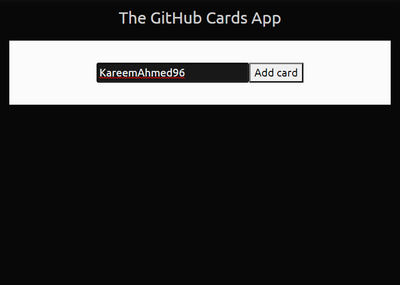
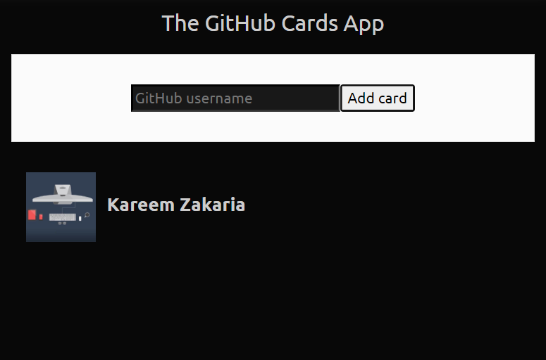

# github-cards-app
This app uses the GitHub API to query users on the platform and displays them in a card form with their name and company.

It is created using the React library.

This is the **Main Screen**

Adding a **Card**

Adding **Multiple Cards** and Displaying their **Companies**

